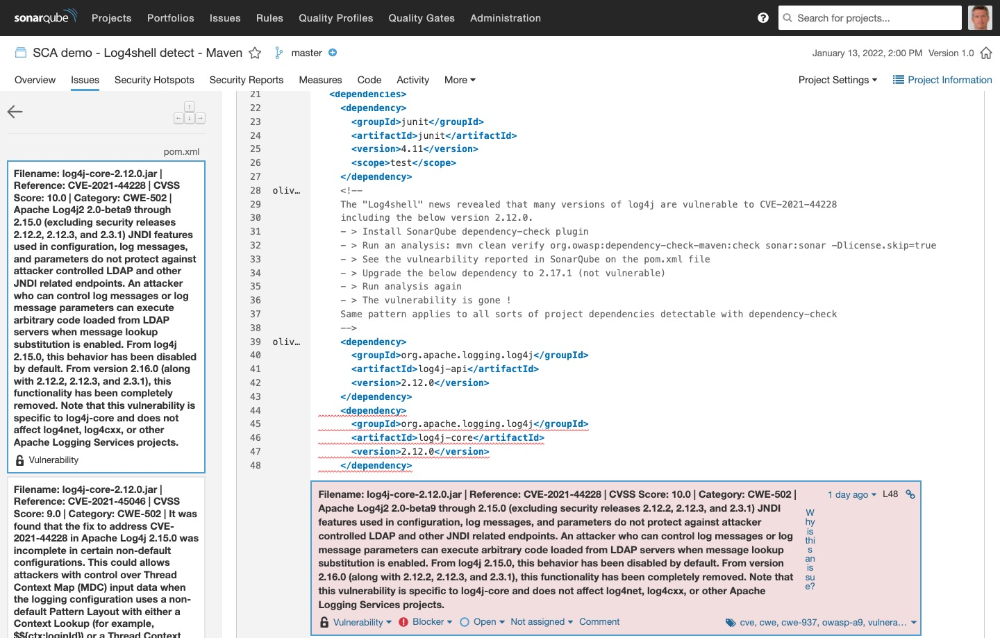

## log4shell-detect

This sample project demoes detection of the log4shell vulnerabilibity with [OWASP DependencyCheck SCA tool](https://owasp.org/www-project-dependency-check/) integrated with SonarQube.

There's one example with a Maven project and one with a Gradle project
Both use log4j 2.12.0 that's vulnerable to log4shell (Publicly referenced as [CVE-2021-44228](https://www.cve.org/CVERecord?id=CVE-2021-44228))

Just like most SCA tools, dependency check gets the list of vulnerable libraries from the CVE US [National Vulnerability Database NVD](https://cve.mitre.org/cve/).
This site provides this list that can be downloaded/updated at any time.

log4shell is just an example, this demo aims at showing the integration of any SCA (Software Composition Analysis) tool with SonarQube, that out of the box only provides SAST (Static Application Security Testing) security

This capability is independent of any commercial feature. It works will all editions of SonarQube, including the Community Edition

## Steps to demo:

1. Install the [SonarQube dependency-check plugin](https://github.com/dependency-check/dependency-check-sonar-plugin/releases) on your SonarQube platform

2. Configure `dependency-check` to generate both a HTML and JSON report. This is achieved with the `format=ALL` or `formats=HTML,JSON` configuration
   of `dependency-check`. In this example, the format configuration is in the [pom.xml](maven-example/pom.xml#L107) for the maven example and in the (gradle-example/build.gradle#L25)[build.gradle] for the gradle example

3. Configure the SonarQube dependency-check plugin to look for the generated JSON and HTML reports in the expected locations. This is achieved with the
   2 properties `sonar.dependencyCheck.htmlReportPath` and `sonar.dependencyCheck.jsonReportPath` (see again [pom.xml](maven-example/pom.xml#L17) or [build.gradle](gradle-example/build.gradle#L20))

3. Run analysis (with Maven or Gradle, see below)

## With Maven

- Under the `maven-example` directory simply run: `mvn clean verify org.owasp:dependency-check-maven:check sonar:sonar -Dlicense.skip=true`
- Browse to your project in SonarQube and check the list of vulnerabilities. At least one should be attached to the `pom.xml`file that holds
  the dependency to log4j 2.12.0. You should get something like below
  

- In the [pom.xml](maven-example/pom.xml#L40) file, you may replace the dependency on log4j 2.12.0 by 2.17.1 (that fixes the log4shell vulnerability)

- Re-run the analysis as per the above, and the vulnerability will be gone in SonarQube.

## With Gradle

- Under the `gradle-example` directory simply run: `./gradlew dependencyCheckAnalyze sonarqube`

- Browse to your project in SonarQube and check the list of vulnerabilities. At least one should be attached to project itself that holds
  the dependency to log4j 2.12.0. You will get a similar vulnerability as above reported (see [Gradle readme](gradle-example/README.md) for details)

- In the [build.gradle](gradle-example/build.gradle#L40) file, you may replace the dependency on log4j 2.12.0 by 2.17.1 (that fixes the log4shell vulnerability)

- Re-run the analysis as per the above, and the vulnerability will be gone in SonarQube.
  